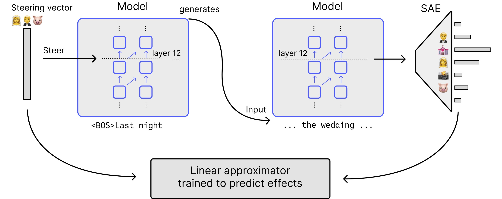

# SAE-TS
Improving Steering Vectors by Targeting Sparse Autoencoder Features



Paper: [Improving Steering Vectors by Targeting Sparse Autoencoder Features](https://arxiv.org/abs/2411.02193)

## Abstract
To control the behavior of language models, steering methods attempt to ensure that outputs of the model satisfy specific pre-defined properties. Adding steering vectors to the model is a promising method of model control that is easier than finetuning, and may be more robust than prompting. However, it can be difficult to anticipate the effects of steering vectors produced by methods such as CAA or the direct use of SAE latents. In our work, we address this issue by using SAEs to measure the effects of steering vectors, giving us a method that can be used to understand the causal effect of any steering vector intervention. We use this method for measuring causal effects to develop an improved steering method, **SAE-Targeted Steering** (SAE-TS), which finds steering vectors to target specific SAE features while minimizing unintended side effects. We show that overall, SAE-TS balances steering effects with coherence better than CAA and SAE feature steering, when evaluated on a range of tasks.

## Installation

```bash
pip install -e .
```

Create a `.env` file in the root directory with your OpenAI API key (required for evaluations):
```
OPENAI_API_KEY='sk-...'
```

## Pipeline Steps

The pipeline consists of four main scripts that should be run separately in sequence. The first script is expensive so you can e.g. run just the evals and the trained effect approximator will be downloaded automatically.

1. Generate feature effects:
```bash
python -m sae_ts.ft_effects.multi_gpu
```
This script uses multiple GPUs to measure how steering vectors affect model behavior.

2. Train the effect approximator:
```bash
python -m sae_ts.ft_effects.train
```
Trains a linear model to predict feature effects from steering vectors. If you don't have locally generated feature effects data, it will automatically download pre-computed effects from HuggingFace.

3. Run evaluations:
```bash
python -m sae_ts.baselines.analysis
```
Evaluates different steering methods (CAA, SAE steering, SAE-TS). If you don't have a locally trained adapter, it will download a pre-trained one from HuggingFace.

4. Generate plots:
```bash
python -m sae_ts.baselines.plots
```
Creates plots used in the paper.